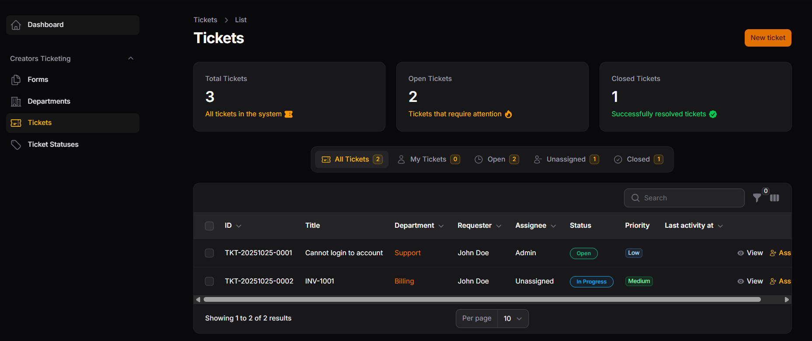
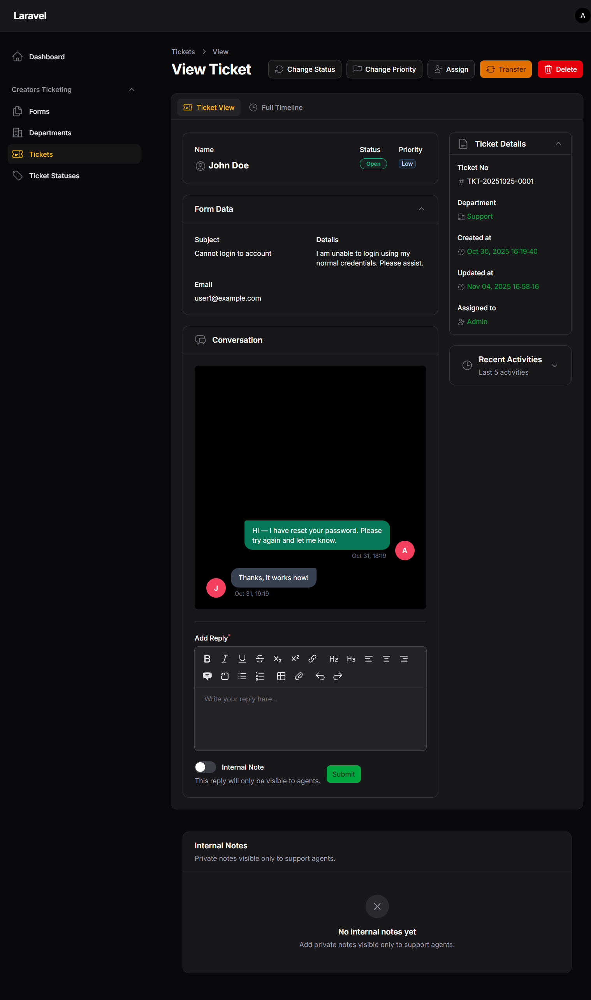
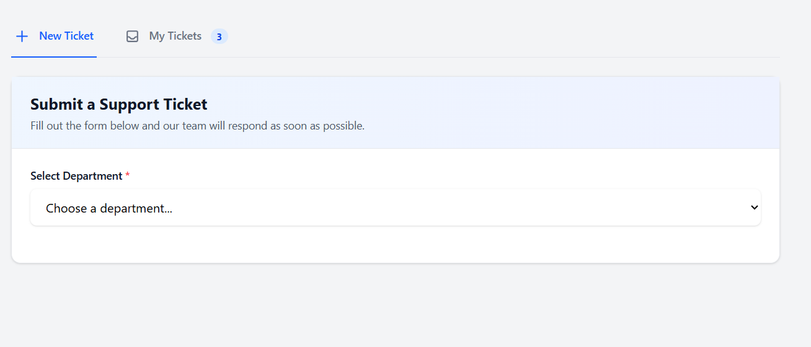
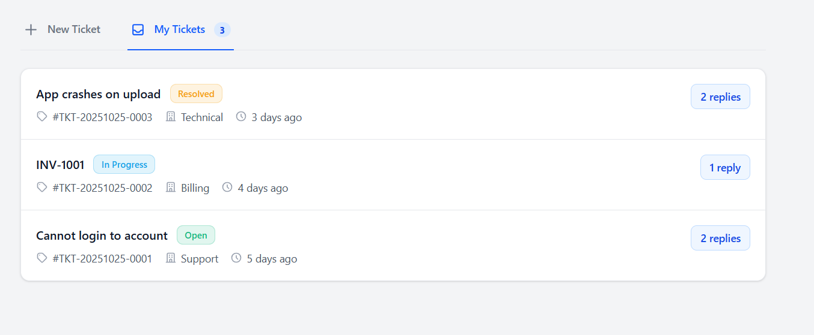
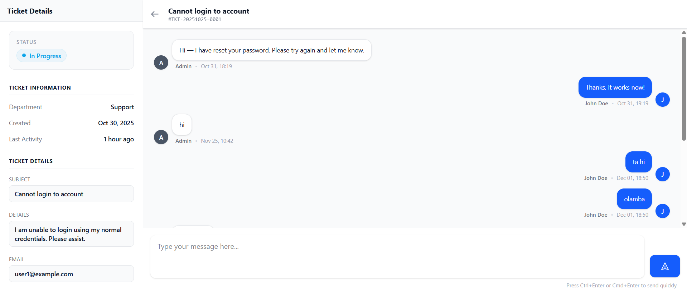
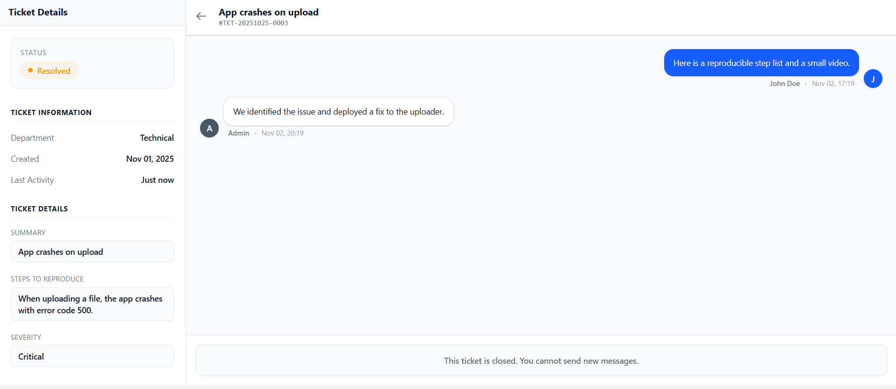

# Creators Ticketing for Filament v4

[](https://packagist.org/packages/daacreators/creators-ticketing)
[](https://packagist.org/packages/daacreators/creators-ticketing)
[](LICENSE.md)

A robust and dynamic ticketing system plugin for Filament 4, providing a complete helpdesk solution for your Laravel application.

## Screenshots


_Tickets List_


_Ticket View_


_Submit Ticket Form_


_User's Tickets List_


_User's Chat View_


_User's Chat View with Closed Status_

## Features

- Full ticketing system with departments and forms
- Agent management with department assignments
- Custom form builder for ticket submissions
- Real-time ticket chat using Livewire
- Ticket statistics dashboard widget
- Granular permission system
- Read/Unread status indicators for agents
- File attachments support
- Responsive design
- Multi-language support
- Seamless integration with Filament 4

## Requirements

- PHP 8.2 or higher
- Laravel 11.x|12.x
- Filament 4.1.7 or higher
- Livewire 3.x

## Installation

You can install the package via composer:

```bash
composer require daacreators/creators-ticketing
```

After installation, publish the config file:

```bash
php artisan vendor:publish --tag="creators-ticketing-config"
```

Setup: Filament Panel Integration:
The plugin integration code should be added to your main Filament admin panel provider file, which is typically located at:
Open your AdminPanelProvider.php file and modify the panel() method as shown below. You need to include the use statement for the plugin class and call TicketingPlugin::make() inside the ->plugins() array.

```
app/Providers/Filament/AdminPanelProvider.php
```

```php
use Filament\Panel;
use Filament\PanelProvider;
use daacreators\CreatorsTicketing\TicketingPlugin; // Add this line

class AdminPanelProvider extends PanelProvider
{
    public function panel(Panel $panel): Panel
    {
        return $panel
            ->default()
            // ... other panel configuration ...
            ->plugins([
                TicketingPlugin::make(), // Add the plugin call here
            ])
            // ... rest of the panel configuration ...
    }
}
```

Run the migrations:

```bash
php artisan migrate
```

### Adding User Model Relation

Add the `tickets()` relation to your User model. Open your User model file (typically `app/Models/User.php`) and add the following method:

```php
use Illuminate\Database\Eloquent\Relations\HasMany;
use daacreators\CreatorsTicketing\Models\Ticket;

/**
 * @return HasMany<Ticket, $this>
 */
public function tickets(): HasMany
{
    return $this->hasMany(Ticket::class);
}
```

### Seeding Ticket Statuses

After running migrations, you can seed default ticket statuses using the provided seeder:

```bash
php artisan db:seed --class=daacreators\\CreatorsTicketing\\Database\\Seeders\\TicketStatusSeeder
```

This will create the following default ticket statuses:

- **Open** (Blue) - Default status for new tickets
- **In Progress** (Amber) - Tickets being worked on
- **Answered** (Green) - Tickets that have been answered
- **Pending** (Purple) - Tickets waiting for response
- **Resolved** (Green) - Tickets that have been resolved
- **Closed** (Gray) - Closing status for completed tickets

The seeder uses `updateOrCreate` to prevent duplicates, so you can safely run it multiple times.

## Upgrading

### Upgrading from v1.0.5 to v1.0.6

**⚠️ Important:** Version 1.0.6 introduces new fields to the database table. If you are upgrading from a previous version, you **must** run the migrations after updating the package to ensure the system functions correctly:

```bash
php artisan migrate
```

## Configuration

### Basic Configuration

Configure the package by setting values in your `.env` file or directly in the `config/creators-ticketing.php` file:

```php
// Navigation group name in Filament sidebar
TICKETING_NAV_GROUP="Creators Ticketing"

// User model (if different from default)
USER_MODEL="\App\Models\User"

// Navigation visibility rules
TICKETING_NAV_FIELD=email
TICKETING_NAV_ALLOWED=admin@demo.com,manager@demo.com
```

### Navigation Visibility

You can control who sees the ticketing resources in the admin panel by configuring the navigation visibility rules:

```php
'navigation_visibility' => [
    'field' => 'email', // or any other field like role_id
    'allowed' => ['admin@site.com', 'manager@site.com']
],
```

## Multi-language Support

This plugin is fully localized and supports multiple languages out of the box. It automatically detects and uses your application's current locale configuration (`config/app.php`).

**Currently supported languages:**

- 🇺🇸 **English** (`en`) - Default
- 🇪🇸 **Spanish** (`es`)
- 🇧🇷 **Portuguese (Brazil)** (`pt_BR`)
- 🇫🇷 **French** (`fr`)
- 🇩🇪 **German** (`de`)
- 🇸🇦 **Arabic** (`ar`)
- 🇨🇳 **Chinese (Simplified)** (`zh_CN`)

### Publishing Translations

If you wish to modify the texts or add a new language, you can publish the translation files:

```bash
php artisan vendor:publish --tag="creators-ticketing-translations"
```

## Usage

### Creating Forms

1. Go to the Forms section in the admin panel
2. Create a new form with custom fields

### Setting Up Departments

1. Navigate to the Filament admin panel
2. Go to the Departments section
3. Create departments and assign agents
4. Assign the form to specific departments

### Managing Tickets

Tickets can be managed through the Filament admin panel. You can:

- View all tickets **(New updates are marked with a "NEW" badge)**
- Assign tickets to agents
- Change ticket status
- Add internal notes
- Communicate with users
- Track ticket activities

### Frontend Integration

To add the tickets and ticket submission form to your frontend:

```blade
\\ Add to your blade file
@livewire('creators-ticketing::ticket-submit-form')
```

## Dashboard Widget

The package includes a ticket statistics widget. Add it to your Filament dashboard:

```php
use daacreators\CreatorsTicketing\Filament\Widgets\TicketStatsWidget;

class DashboardConfig extends Config
{
    public function widgets(): array
    {
        return [
            TicketStatsWidget::class,
        ];
    }
}
```

## Security

The package includes built-in security features:

- Private file storage for attachments
- Permission-based access control
- Department-level agent restrictions

## Contributing

Thank you for considering contributing to Creators Ticketing! You can contribute in the following ways:

1. Report bugs
2. Submit feature requests
3. Submit pull requests
4. Improve documentation

## License

The MIT License (MIT). Please see [License File](LICENSE) for more information.

## Credits

- [Jabir Khan](https://github.com/jabirmayar)
- [All Contributors](../../contributors)

## Support

If you discover any security-related issues, please email hello@jabirkhan.com.

**Built with ❤️ by [DAA Creators](https://daacreators.com)**
